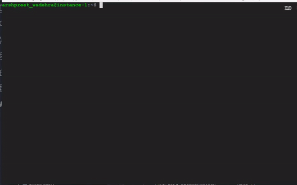

# @react/create-library
> Command Line tool to generate boilerplate for your react library.

Create React Library with no build configuration.

## Usage

```sh
npx react-library my-library
```


  

## Features

- User friendly CLI Interface
- Handles all modern JS features
- Bundles `cjs`, `esnext`, `umd` and `es` module formats
- Support for `TypeScript` and `flow` type System
- Support for documentation library like `docz`, `storybook` and `react-styleguidist`
- Support for different styling like `css`, `less`, `scss`, `emotion` and `styled-component`
- [Standard-version](https://www.npmjs.com/package/standard-version) for manage versioning and CHANGELOG generation
- Prettier, Eslint & Stylelint added to maintain the code quality & readability.
- [Rollup](https://rollupjs.org/) for bundling & sourcemap generation
- [Babel](https://babeljs.io/) for transpiling
- [Jest](https://facebook.github.io/jest/) for testing
- Working example setup using [create-react-app](https://github.com/facebook/create-react-app)


### CLI Options

```
Usage: react-library <package-name> [Options]

Options:
  -V, --version          output the version number
  --verbose              print additional logs
  --pm <value>           Package Manager (npm or yarn)
  --type <value>         Type System for project one of default,typescript,flow (default: "none")
  --doc <value>          Documentation Library one of none,docz,storybook,react-styleguidist (default: "docz")
  --style <value>        Styling Library one of inline,css,less,scss,emotion,styled-component (default: "inline")
  -l, --license <value>  License of Project (default: "MIT")
  -s, --skip             Skip all question and create project with defaults
  -h, --help             output usage information


Node version require >= 8 & npm >= 5
```

If something doesn’t work, please [file an issue](https://github.com/wadehrarshpreet/react-library/issues/new)
